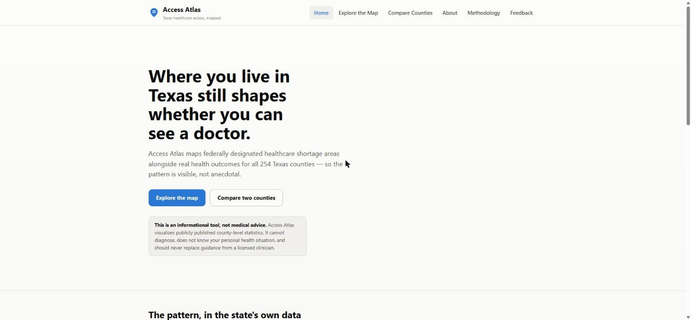
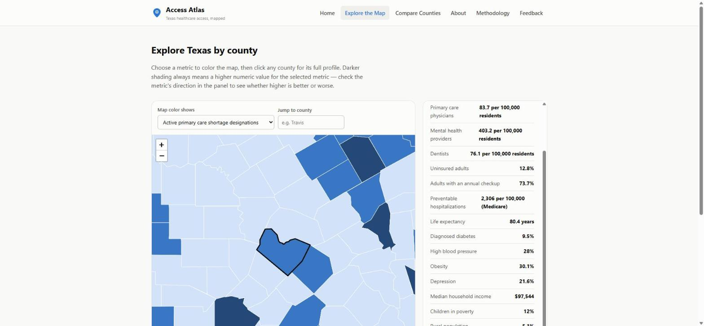
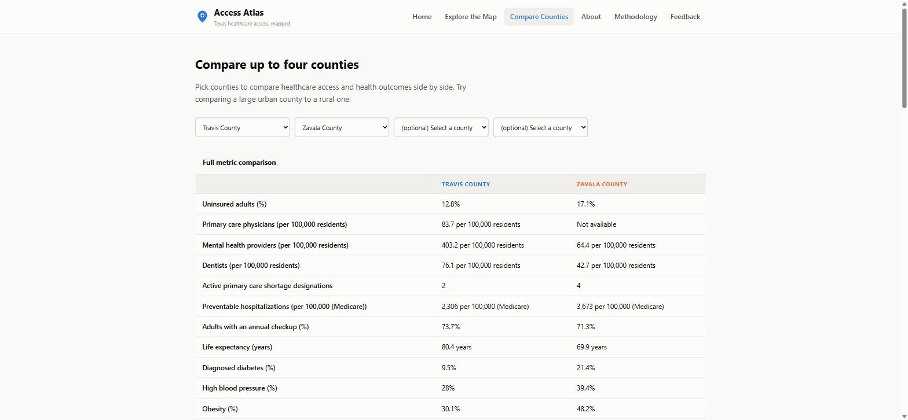

# Access Atlas

**Mapping healthcare access across all 254 Texas counties, using public federal and academic data.**

Access Atlas is an independent student project that visualizes HRSA Health Professional Shortage Area (HPSA) designations, County Health Rankings provider-supply data, and CDC PLACES health outcome estimates — joined at the county level — so the pattern of healthcare access across Texas is visible to the public, not just to health-policy researchers.

**Live site:** https://ammaarahmedcolleyville.github.io/access-atlas/
**Repository:** https://github.com/ammaarahmedcolleyville/access-atlas



## What it does

- **[Explore the Map](docs/explore.html):** an interactive choropleth of Texas by any of 14 access/outcome metrics, with county search and a full data panel on click.
- **[Compare Counties](docs/compare.html):** put 2–4 counties side by side across every metric, with grouped bar-chart comparisons.
- Every number links back to its source and definition on the **[Methodology](docs/methodology.html)** page, including an explicit list of what the data *cannot* tell you.




## Why

Whether a county has a federally recognized primary care shortage is a real regulatory fact with real consequences (it affects loan-repayment eligibility for providers, community health center funding, and Medicare bonus payments) — and in the data this project collected, it affects **93% of Texas counties**, home to **95% of the state's population**. Most residents have never seen this data visualized. See [`docs/about.html`](docs/about.html) for the full "why."

## Tech stack

- **Data pipeline:** Python (pandas, requests, pyshp) — see [`documentation/ARCHITECTURE.md`](documentation/ARCHITECTURE.md) for the full data flow.
- **Storage:** SQLite (durable copy of the cleaned dataset) + static JSON (what the site actually loads).
- **Frontend:** plain HTML/CSS/JavaScript, no build step, [Leaflet](https://leafletjs.com/) for the map.
- **Hosting:** GitHub Pages, served from `/docs`.

## Running it yourself

```bash
git clone https://github.com/ammaarahmedcolleyville/access-atlas.git
cd access-atlas

# Rebuild the data from scratch (optional — docs/data/*.json is already committed)
pip install pandas requests openpyxl pyshp
python data-pipeline/scripts/01_fetch_data.py
python data-pipeline/scripts/02_extract_geometry.py
python data-pipeline/scripts/03_clean_and_join.py

# Preview the site locally
cd docs
python -m http.server 8765
# then open http://localhost:8765
```

No API keys, accounts, or paid services are required anywhere in this project.

## Documentation

| Doc | Covers |
|---|---|
| [`documentation/DATA_SOURCES.md`](documentation/DATA_SOURCES.md) | Every dataset used, exact URLs, retrieval dates, field-level notes |
| [`documentation/ARCHITECTURE.md`](documentation/ARCHITECTURE.md) | System design and why it's shaped this way |
| [`documentation/BRANDING.md`](documentation/BRANDING.md) | Name, logo, color, and typography rationale |
| [`documentation/USER_TESTING.md`](documentation/USER_TESTING.md) | Usability testing plan, feedback categories, decision framework |
| [`documentation/CHANGELOG.md`](documentation/CHANGELOG.md) | Version history |
| [`docs/methodology.html`](docs/methodology.html) | Public-facing data sources, definitions, and **limitations** |
| [`STUDENT_CONTRIBUTIONS.md`](STUDENT_CONTRIBUTIONS.md) | What the student building this actually did, decided, and learned |

## Limitations (short version)

This is a single-year snapshot, not a time series. Small counties have data suppressed by the source agencies when a reliable estimate isn't possible. HPSA "underserved population" figures can overlap across multiple designations in the same county. Most importantly: **this shows correlation, never causation** — see the full [Methodology & Limitations](docs/methodology.html#limitations) page.

## Privacy

Access Atlas only publishes pre-aggregated, de-identified, county-level public data. It collects no individual health information. See [Methodology → Privacy](docs/methodology.html).

## Not medical advice

Access Atlas is an informational tool. It does not diagnose, treat, or provide personalized medical guidance, and should never replace advice from a licensed clinician.

## License

Code in this repository is available under the MIT License (see `LICENSE`). Data is redistributed from public sources under their respective public-use terms — see `documentation/DATA_SOURCES.md` for each source's original publisher.
